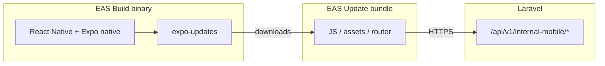

# Internal mobile — dependency roadmap & OTA-first architecture

This document aligns the **Insuring Income** internal mobile app (Expo) dependencies with an **OTA-first** delivery model: ship JS, navigation, styling, copy, and most asset changes via **EAS Update**; reserve **EAS Build / TestFlight** for native surface changes.

## Principles

| Principle | Detail |
|-----------|--------|
| **Runtime contract** | `runtimeVersion` policy is **`appVersion`** (`app.config.ts`). Any OTA must target binaries built with the **same `expo.version`** as the published update. |
| **Channel discipline** | Each EAS Build profile pins an **update channel** (`eas.json`). OTA publishes target the **same channel** as the installed binary (see release runbook). |
| **Least native churn** | Prefer Expo modules with good managed workflow support; defer camera, PDF rendering, and other heavy native stacks until a product requirement forces them. |
| **Parity with Laravel** | Internal APIs live on Laravel (`/api/v1/internal-mobile/*`, operator APIs). Mobile-only packages do not change backend contracts here. |

## OTA-safe vs native-build-required

| Class | OTA-safe (same `runtimeVersion` / channel) | Requires new EAS build + store/TestFlight |
|-------|---------------------------------------------|-------------------------------------------|
| JS/TS, React components, Expo Router screens | Yes | No |
| Styles, copy, validation logic | Yes | No |
| API client, auth flow (JS), SecureStore usage | Yes | No |
| Most `assets/` images referenced from JS | Yes* | No* |
| `app.config.ts` **non-plugin** fields that don’t change native project | Often yes** | Sometimes no** |
| New npm dependency with **only JS** implementation | Usually yes | If it adds no native code |
| New `expo install` package with **config plugin** / native module | No | **Yes** |
| `plugins` / permissions / entitlements / Info.plist | No | **Yes** |
| `newArchEnabled`, Hermes, splash, **app icon**, bundle ID | No | **Yes** |
| `runtimeVersion` policy or `expo.version` bump | No | **Yes** (new binary lineage) |
| Push: first-time APNs entitlements / Google services setup | No | **Yes** (then tokens via OTA JS) |

\*Large asset changes may warrant a store build for App Store size/review optics, but technically they can ship OTA.  
\*\*Treat any `app.config.ts` change as **rebuild by default** unless you have verified no native diff (e.g. `expo doctor` / EAS metadata).

## Current stack (audited)

Already present:

- **Expo SDK 54**, **expo-router**, **expo-updates** (EAS Update URL + `runtimeVersion`), **expo-dev-client**, auth (`expo-auth-session`, `expo-apple-authentication`), **expo-secure-store**, **expo-application**, **expo-constants**, UI primitives.

## Phase 1 — “next safe” dependencies (installed now)

| Package | Role | OTA after first binary? |
|---------|------|-------------------------|
| **expo-updates** | EAS Update client (already depended) | JS check/reload logic OTA; **native module** already in binary. |
| **expo-notifications** | Permission + push token for operator alerts (Laravel already has mobile push hooks conceptually). | **First** inclusion: **new build**. Subsequent handler/UI/token wiring OTA. |
| **expo-document-picker** | Pick files for uploads (no camera). | First build including native module; picker UX OTA. |
| **expo-file-system** | Cache / read picked files / temp paths for upload pipelines. | Same as above. |
| **expo-sharing** | Share exports (CSV/PDF from server) via share sheet — small surface. | Same as above. |

None of the above introduce camera, in-app PDF rendering, or ML.

## Phase 2 — deferred (explicitly out of scope for now)

| Idea | Why defer |
|------|-----------|
| `expo-camera` / `expo-image-picker` | Permission + review burden; not required for internal ops MVP. |
| `expo-print` / native PDF viewers | Heavy; prefer server-generated PDF + `expo-sharing` / WebView only if product demands. |
| `react-native-pdf` / custom native modules | High rebuild + maintenance cost. |
| Background geolocation | Policy and battery risk. |

## Phase 3 — when product requires it

- **Scanning / camera** → gated feature branch + privacy copy + new build.  
- **Offline-first large sync** → design against `expo-file-system` + SQLite (would be a major native + OTA contract decision).  
- **Feature flags** → server-driven (Laravel) + OTA UI; keep `runtimeVersion` stable.

## Architecture sketch (OTA-first)

## Related docs

- `docs/internal-mobile-release-runbook.md` — commands, channels, rollback.  
- Root `README.md` — quick links and security notes.
